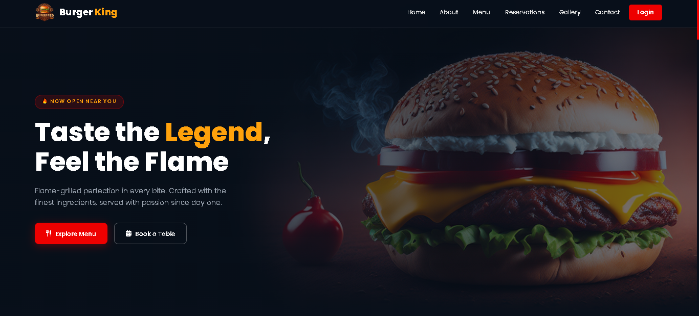
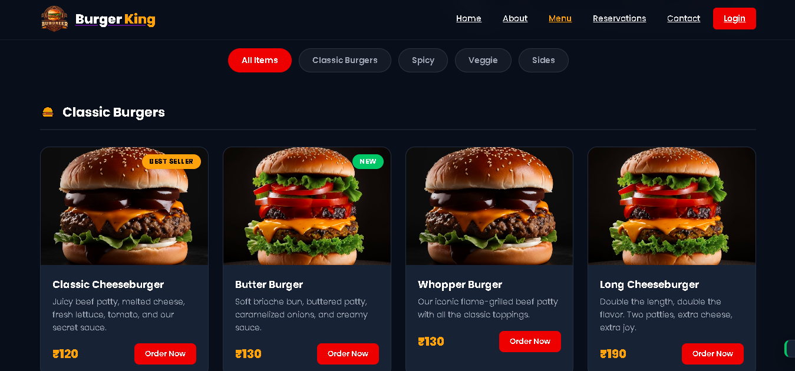

# 🍔 Burger King Website

A premium modern burger restaurant website built using HTML, CSS, and JavaScript.

---

## ✨ Features

- Modern responsive UI
- Smooth scrolling navigation
- Interactive animations
- Food showcase sections
- Mobile-friendly layout
- Clean and modern design

---

## 🛠 Technologies Used

- HTML5
- CSS3
- JavaScript

---

## 📸 Project Preview

A cinematic-style restaurant website focused on modern frontend design and smooth user experience.

---

## 👨‍💻 Author

Pratik Creates
---
## 📸 Screenshots

### Hero Section

### Menu Section

### Mobile Responsive View

